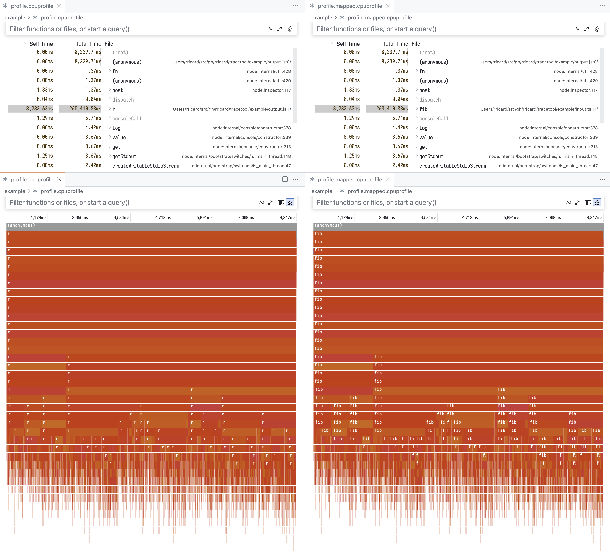

# tracetool

tracetool is a utility to resolve javascript sourcemaps in:

- Chromium event traces taken with the [performance tab](https://developer.chrome.com/docs/devtools/performance/reference) in the chrome inspector
- Node inspector traces taken with the [`node:inspector`](https://nodejs.org/api/inspector.html) API.



## Using the cli tool

```
npx @rricard/tracetool CPUPROFILE_FILE SOURCEMAP_FILE [DECODED_OUTPUT_FILE]
```

For instance, you can try in this repo in the `example/` directory:

```sh
cd ./example
npm install
npm run build
npm start

npx @rricard/tracetool ./profile.cpuprofile ./output.js.map ./profile.mapped.cpuprofile
```

In most cases, this should properly resolve your sources and you can continue
your performance analysis adventure.

Sometimes, however, you will see some source misses that are significant for you:

```js
Input misses Set(2) {
  'http://example.com/foo.js',
  'http://example.com/bar.js'
}
```

In that case, you might want to create your own decoding tool using the API...

## Using the API

The CLI tool can be quite blunt and will not handle very well situations where
you have multiple output files to map.

In this case, we would recommend building up your own cli using the API:

```js
import { decodeCpuProfile } from "@rricard/tracetool";
import { readFile, writeFile } from "node:fs/promises";

const profileJson = JSON.parse(await readFile(process.args[2], "utf8"));
const sourcemaps = {
  "http://example.com/foo.js": JSON.parse(
    await readFile("./foo.js.map"),
    "utf8"
  ),
  "http://example.com/bar.js": JSON.parse(
    await readFile("./bar.js.map"),
    "utf8"
  ),
};
const { decoded, inputMisses } = await decodeCpuProfile(
  profileJson,
  sourcemaps
);
console.warn("Input misses", inputMisses);
await writeFile(process.argv[3], JSON.stringify(decoded), "utf8");
```
